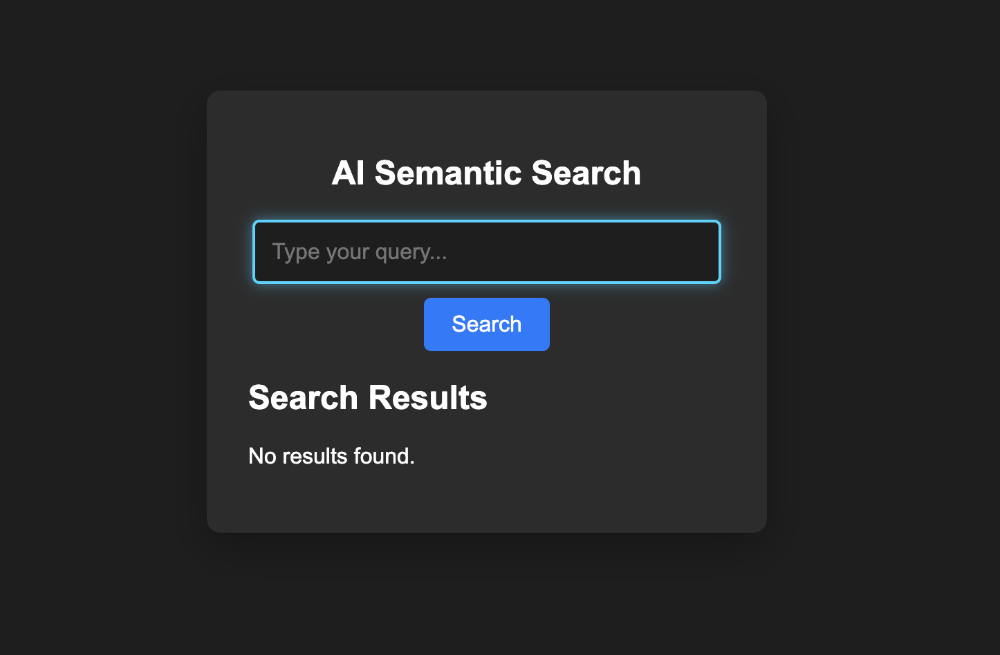

# 🧠 Embedding Analysis Search

A **FastAPI-powered** semantic search engine using **SBERT embeddings** to find the most relevant news articles based on natural language queries. The frontend is built with **React.js** for an intuitive search experience. Also contains, analysis and comparisons on different embeddings methods. Helped me understand the differences between `TF-IDF`, `Sentence-BERT` and `word2vec (CBOW & Skip-gram)`. 

## 🚀 Features
- **FastAPI backend** with semantic search using **Sentence-BERT (SBERT)**
- **React frontend** with smooth UI/UX and real-time search results
- **CORS-enabled** API for seamless communication between front and back
- **Clean animations & modern UI** for an enhanced user experience

---

## 🔍 Search Interface

## 📂 API Endpoints
| Method | Endpoint         | Description                   |
|--------|----------------|-------------------------------|
| `POST` | `/search/`      | Searches for relevant articles |
| `POST` | `/index/`       | Indexes new texts dynamically |

### Example search request:

**json**

{
  "query": "Artificial intelligence in finance",
  "how_much_results": 3
}

## 🔗 Technologies Used
- **Backend**: FastAPI, Uvicorn, `Sentence-BERT`
- **Frontend**: React.js, Axios
- **Styling**: CSS

## To clone :

git clone https://github.com/your-username/semantic-search-project.git
cd semantic-search-project

